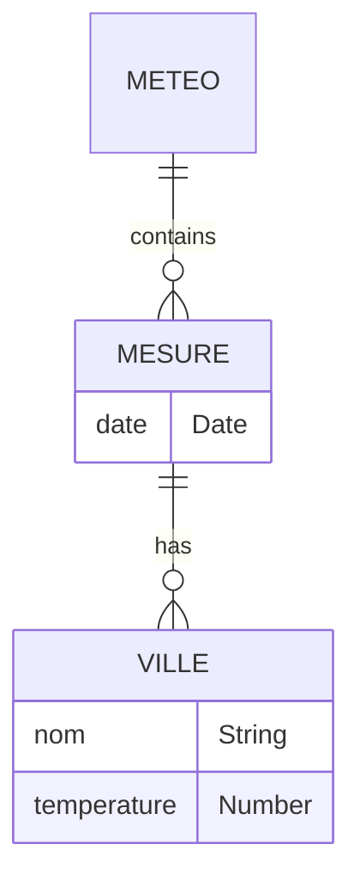
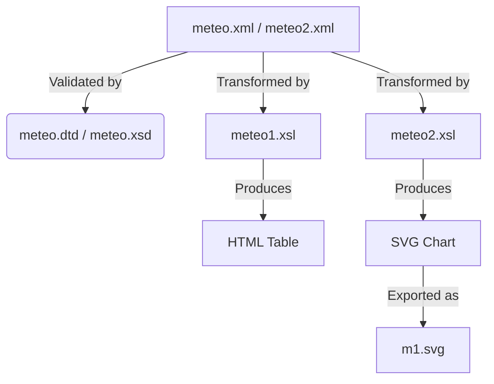

# 🌡️ Weather Measurement XML/XSLT Project Documentation

This project handles meteorological data (city temperatures across dates) using XML, DTD, XSD, XSLT, and SVG. Each file plays a specific role in storing, validating, transforming, or visualizing weather data.

---

## meteo2.xml

This file is a sample **XML data file** that records temperature measurements for multiple cities on two dates. It uses an XML Schema (XSD) for structural validation.

**Structure Overview:**
- Root element: `<meteo>`
- Children: Multiple `<mesure>` elements (one per date)
- Each `<mesure>` has a `date` attribute and contains multiple `<ville>` elements with `nom` and `temperature` attributes

**Sample Data:**
```xml
<meteo xmlns:xsi="http://www.w3.org/2001/XMLSchema-instance" xsi:noNamespaceSchemaLocation="meteo.xsd">
  <mesure date="2025-10-10">
    <ville nom="Casablanca" temperature="22"/>
    <ville nom="tanger" temperature="25"/>
    <ville nom="Settat" temperature="29"/>
    <ville nom="Taza" temperature="32"/>
    <ville nom="Dakhla" temperature="26"/>
    <ville nom="Laayoune" temperature="22"/>
  </mesure>
  <mesure date="2025-10-11">
    <ville nom="Casablanca" temperature="23"/>
    <ville nom="tanger" temperature="26"/>
    <ville nom="Settat" temperature="27"/>
    <ville nom="Taza" temperature="35"/>
    <ville nom="Dakhla" temperature="30"/>
    <ville nom="Laayoune" temperature="28"/>
  </mesure>
</meteo>
```

**Key Points:**
- Designed for use with both **DTD** and **XSD** validation.
- Includes city names and temperature values for each date.

---

## meteo.dtd

The **DTD (Document Type Definition)** file defines the allowed structure and attributes for the XML data in `meteo.xml`.

**DTD Content:**
```dtd
<!ELEMENT meteo (mesure+) >
<!ELEMENT mesure (ville+) >
<!ELEMENT ville EMPTY >
<!ATTLIST mesure date CDATA #REQUIRED >
<!ATTLIST ville nom CDATA #REQUIRED temperature CDATA #REQUIRED >
```

**Key Elements:**
- `<meteo>` must contain one or more `<mesure>` elements.
- `<mesure>` must contain one or more `<ville>` elements.
- `<ville>` elements are empty but must have `nom` and `temperature` attributes.
- `date` attribute is required for `<mesure>`.

---

## meteo2.xsl

This **XSLT 2.0 stylesheet** transforms the XML data into an SVG-based animated bar chart, visualizing city temperatures for a specific date (2025-10-10).

**Core Features:**
- Generates vertical axes for the chart.
- Iterates over all cities for the selected date.
- Draws a colored, animated bar for each city's temperature.
- Displays city names and temperature labels.

**Sample Code:**
```xml
<svg xmlns="http://www.w3.org/2000/svg" width="100%" height="100%">
  <line x1="100" y1="100" x2="100" y2="600" stroke="black" stroke-width="2"></line>
  <line x1="100" y1="600" x2="1000" y2="600" stroke="black" stroke-width="2"></line>
  <xsl:for-each select="meteo/mesure[@date='2025-10-10']/ville">
    <!-- City label, bar, animated values, etc. -->
  </xsl:for-each>
</svg>
```

**Highlights:**
- Uses XSLT variables to position bars and compute heights.
- SVG `<animate>` elements for animated effects.
- Only visualizes the date `2025-10-10`.

---

## README.md

The **README** introduces the project and its main technologies:

```markdown
# 🌡️ Activité XML / XSL — Mesures de Températures des Villes
Ce projet consiste à manipuler des fichiers **XML, DTD, XML Schema (XSD), XSLT et SVG** autour d’un document météo contenant les températures de plusieurs villes à différentes dates.
---
```

**Summary:**
- Project is about manipulating weather data using XML standards and visualizing results.
- Technologies: XML, DTD, XSD, XSLT, SVG.

---

## LICENSE

The project uses the **MIT License**, allowing free use, modification, and distribution, with no warranty.

```text
MIT License

Copyright (c) 2025 adhammad

Permission is hereby granted, free of charge, to any person obtaining a copy of this software...
```

**Key Points:**
- Open source, permissive.
- Requires including the license in substantial portions of the software.

---

## m1.svg

This file is an **SVG graphic** generated (or exportable) from the XSLT transformation of the weather data for 2025-10-10.

**Key Features:**
- Contains axes and bars for each city's temperature.
- Each `<rect>` visualizes a city's temperature, with animated growth and shrinkage.
- Bars are labeled with city names and temperatures.

**Partial Example:**
```xml
<rect width="20" height="220" x="120" y="380" stroke="black" fill="orange">
  <animate attributeName="height" values="0;220;0" repeatCount="indefinite" dur="3s" from="0"/>
  <animate attributeName="y" values="600;380;600" repeatCount="indefinite" dur="3s" from="600"/>
</rect>
```

---

## m1.html

A **minimal SVG file** containing only the chart axes. This can serve as a base for further SVG drawing or as a template before adding data bars.

**Contents:**
```xml
<svg xmlns="http://www.w3.org/2000/svg" width="100%" height="100%">
  <line x1="100" y1="100" x2="100" y2="600" stroke="black" stroke-width="2"/>
  <line x1="100" y1="600" x2="1000" y2="600" stroke="black" stroke-width="2"/>
</svg>
```

---

## meteo1.xsl

This **XSLT 2.0 stylesheet** transforms the XML weather data into an HTML table, summarizing city temperatures for 2025-10-11.

**Features:**
- Outputs the measurement date.
- Lists each city and its temperature in a table.
- Computes and displays the number of cities and average temperature.

**Sample Output (HTML Table):**
```html
<table border="1" width="90%">
  <tr>
    <th>Ville</th>
    <th>Temperature</th>
  </tr>
  <!-- Dynamic rows per city -->
  <tr>
    <td>Nombre des Villes</td>
    <td>6</td>
  </tr>
  <tr>
    <td>temperature Moyenne</td>
    <td>28.166666666666668</td>
  </tr>
</table>
```

---

## meteo.xml

This is a **DTD-validated XML data file** containing temperature measurements for cities, similar to `meteo2.xml` but with one less city per date and using a DTD for validation.

**Sample Data:**
```xml
<meteo>
  <mesure date="2025-10-10">
    <ville nom="Casablanca" temperature="22"/>
    <ville nom="tanger" temperature="25"/>
    <ville nom="Settat" temperature="29"/>
    <ville nom="Taza" temperature="32"/>
    <ville nom="Dakhla" temperature="26"/>
  </mesure>
  ...
</meteo>
```

**Key Differences:**
- Uses a `<!DOCTYPE meteo SYSTEM "meteo.dtd">` declaration.
- One less city per date than `meteo2.xml`.

---

## meteo.xsd

The **XSD (XML Schema Definition)** file provides a more precise schema for validating XML weather data.

**Schema Highlights:**
- `<meteo>`: Contains one or more `<mesure>` elements.
- `<mesure>`: Requires `date` (ISO date format) and one or more `<ville>`.
- `<ville>`: Requires `nom` (string) and `temperature` (double).

**Core XSD Excerpt:**
```xml
<xsd:element name="meteo">
  <xsd:complexType>
    <xsd:sequence>
      <xsd:element name="mesure" minOccurs="1" maxOccurs="unbounded" type="T_MESURE"/>
    </xsd:sequence>
  </xsd:complexType>
</xsd:element>
```

---

## Data Model Visualization

The project’s data structure can be visualized as an Entity-Relationship diagram:



---

## Data Transformation Process

The flow from data source to visualization can be represented as follows:



---

## Summary Table

| File         | Type        | Purpose                                                           |
|--------------|-------------|-------------------------------------------------------------------|
| meteo2.xml   | XML Data    | Weather data for multiple cities/dates, XSD validated             |
| meteo.dtd    | DTD         | Defines allowed XML structure for DTD validation                  |
| meteo2.xsl   | XSLT        | Generates animated SVG bar chart for a date's temperatures        |
| README.md    | Markdown    | Project introduction and purpose                                  |
| LICENSE      | License     | MIT License, open source terms                                   |
| m1.svg       | SVG         | SVG chart output (animated bars for city temperatures)            |
| m1.html      | SVG         | Base SVG axes, no data bars                                      |
| meteo1.xsl   | XSLT        | Generates HTML table with summary for a date                      |
| meteo.xml    | XML Data    | Weather data (DTD validated), fewer cities than meteo2.xml        |
| meteo.xsd    | XSD         | XML Schema: strict type/structure validation                      |

---

```card
{
    "title": "Best Practice",
    "content": "Validate XML files with both DTD and XSD, and transform them using XSLT for readable or visual outputs."
}
```

---

## Conclusion

This project demonstrates a complete workflow for managing, validating, transforming, and visualizing weather data using XML technologies. It is a solid example of how structured data and style sheets can power both human-readable reports and engaging visualizations.
